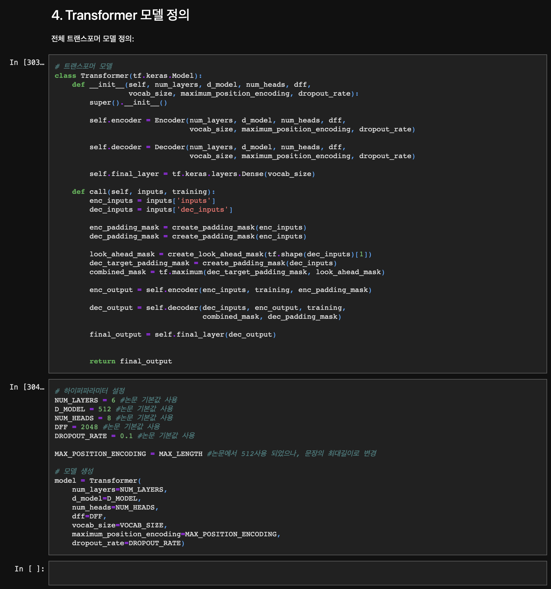

# AIFFEL Campus Online Code Peer Review Templete
- 코더 : 김용석
- 리뷰어 : 김희찬


# PRT(Peer Review Template)
- [X]  **1. 주어진 문제를 해결하는 완성된 코드가 제출되었나요?**
    - 문제에서 요구하는 최종 결과물이 첨부되었는지 확인
        - 문제에서 요구하는 최종 결과물이 첨부되었습니다.
        


- [X]  **2. 전체 코드에서 가장 핵심적이거나 가장 복잡하고 이해하기 어려운 부분에 작성된 
주석 또는 doc string을 보고 해당 코드가 잘 이해되었나요?**
    - 주석을 보고 코드 이해가 잘 되었는지 확인
        - cell 사이사이 마다 markdown을 통해 주석을 잘 남겨주셨습니다.
        

        
- [X]  **3. 에러가 난 부분을 디버깅하여 문제를 해결한 기록을 남겼거나
새로운 시도 또는 추가 실험을 수행해봤나요?**
    - 프로젝트 평가 기준에 더해 추가적으로 수행한 나만의 시도, 
    실험이 기록되어 있는지 확인
        - 손실함수를 재정의하여 학습 안정성을 향상시켰습니다.
        

        
- [X]  **4. 회고를 잘 작성했나요?**
    - 주어진 문제를 해결하는 완성된 코드 내지 프로젝트 결과물에 대해
    배운점과 아쉬운점, 느낀점 등이 기록되어 있는지 확인
      - 마지막줄에 회고를 잘 작성하였습니다. 
      

        
- [X]  **5. 코드가 간결하고 효율적인가요?**
    - 파이썬 스타일 가이드 (PEP8) 를 준수하였는지 확인
    - 코드 중복을 최소화하고 범용적으로 사용할 수 있도록 함수화/모듈화했는지 확인
        - 트랜스포머 모델을 함수화하여 잘 구현하였습니다.
        


# 회고(참고 링크 및 코드 개선)
```
전반적으로 코드가 매끄럽고 이해하기 쉬웠습니다.
특히, 손실함수를 개선 시킨 코드가 인상적이었습니다.
체크포인트를 활용하여 모델 저장하는 방법이 테스트할 때 아주 좋은 것 같습니다.
```
